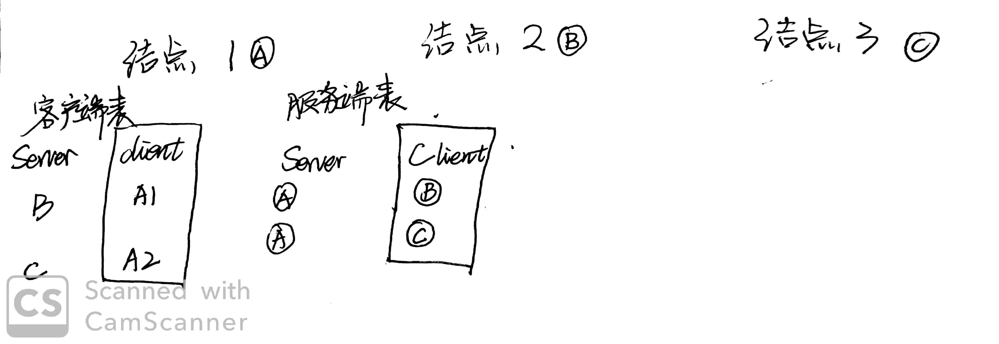
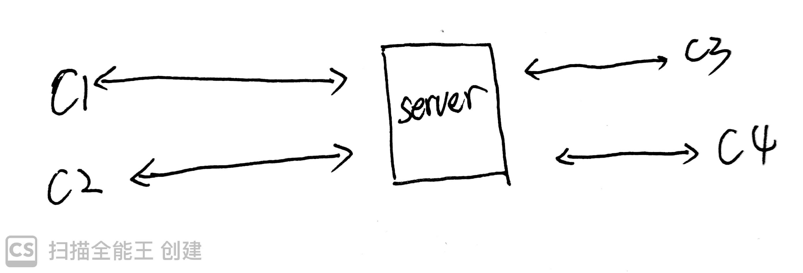

## Java 构建p2p网络

这篇文章是一篇关于pbft算法实现的一篇补充文章，但是在这里不会涉及pbft的算法方面，所以可以当做一篇单独的文章食用。如果想查看关于区块链或者PBFT算法的文章，可以参考一下我的[文章](https://www.cnblogs.com/xiaohuiduan/category/1635542.html)。

### 文章实现范围

这篇文章是构建一个p2p网络，需要拥有独立的ip地址（当然如果是在局域网内使用就无所谓了），不会涉及到内网穿透的一些实现方法，也就是说如果你是把自己电脑构建了一个p2p结点，则其他人的电脑是无法链接你电脑的结点的。

### 预备知识

p2p网络中，一个结点既是客户端也是服务端，可以实现任意时刻的双向的通信。因此在每个结点中，会维护一张客户端的表和一张服务端的表。我们可以从代码的方面来理解一下这个东西，如下图所示：



> 两个被方框圈住的表则是需要维护的表，如果在代码中的话，我们就可以使用List去保存这张表
>
> 客户端的表我们可以用来发送消息，而服务端的表我们可以用来控制群发。

这里我们可以解释和理解一下何为p2p。举例：

结点1想与结点2进行通信时：A1跑出来说，我有到结点2的通道，然后向结点2发出`request`，结点2的服务端接收到结点1（A1）发出来的消息的时，进行response。

这个时候，可能就会有人问：为什么不是结点1的服务端向结点2发出request呢，然后结点2再向服务端返回response？yes，这个是可以的，并且能够成功。那是不是意味着客户端的表实际上可以不要？`当然不是！！！`首先我们从哲学的角度理解这个东西，request理所当然应该是client发出来的，response也应当是response发出来的。当然，这个完全是扯蛋。在两个结点中，一个当做server一个当做client，这样确实不会出现问题，当时如果是3个节点呢？这样做能不能实现两两`单独`发送呢？很抱歉，不能。（注意，在这里是两个结点直接进行request和response，而不借助其他结点）。

下面这种模式是一个结点只为Server，另外的几个也只为Client。在这种模式中，C1和其他的结点无法独自进行两两通信，必须借助Server来进行通信。


OK，说了这么多，那么现在让我们来进行构建P2P网络

### Java构建项目

在这里，我将使用maven构建项目，下面是需要使用的工具类：

- t-io：进行Socket通信。当然，t-io不是必须的，使用websocket或者netty都是可以的

项目地址：[github](https://github.com/xiaohuiduan/p2p_java)

代码其实没什么好讲的，主要是不熟悉tio的使用，这里，emm，吐槽一下tio，妈耶，文档也太贵了吧（╮(╯▽╰)╭，学生优惠没有了，哭唧唧）。


### 代码解释

代码其实很简单，就是开上几个server，然后client连接Server就行了。

主要代码如下所示（实际上使用什么框架都行，自己喜欢就行，把思路弄好就可以了）：

```java
public static void main(String[] args) {
        Scanner in = new Scanner(System.in);
        String ip = "127.0.0.1";
        // 服务端开始
        System.out.println("请输入服务端初始化端口：");
        int port = in.nextInt();
        // 处理消息handler
        ServerAioHandler handler = new P2PServerAioHandler();
        // 监听
        ServerAioListener listener = new ServerListener();
        // 配置
        ServerTioConfig config = new ServerTioConfig("服务端", handler, listener);
        // 设置timeout
        config.setHeartbeatTimeout(Const.TIMEOUT *2);
        TioServer tioServer = new TioServer(config);
        try {
            // 启动
            tioServer.start(ip, port);
        } catch (IOException e) {
            System.out.println("启动错误：" + e.getMessage());
        }

        // client开始
        ClientChannelContext[] contexts = new ClientChannelContext[3];
        for (int i = 0; i < 3; i++) {
            // client的handler
            ClientAioHandler clientAioHandler = new P2pClientAioHandler();
            // client 的配置
            ClientTioConfig clientTioConfig = new ClientTioConfig(clientAioHandler, new P2PClientLinstener(),new ReconnConf(Const.TIMEOUT));
            clientTioConfig.setHeartbeatTimeout(Const.TIMEOUT);
            ClientChannelContext context;
            try {
                TioClient client = new TioClient(clientTioConfig);
                System.out.println("输入端口：");
                int serverPort = in.nextInt();
                context = client.connect(new Node(ip, serverPort), Const.TIMEOUT);

                contexts[i] = context;
            } catch (Exception e) {
                System.out.println("客户端启动错误：" + e.getMessage());
            }
        }

        while (true) {
            System.out.println("请输入发送的服务端的index");
            int index = in.nextInt();
            System.out.println("请输入发送的内容");
            String body = in.next();
            try {
                MsgPacket msgPacket = new MsgPacket();
                msgPacket.setBody("测试数据".getBytes(MsgPacket.CHARSET));
                Tio.send(contexts[index], msgPacket);
            } catch (UnsupportedEncodingException e) {
                e.printStackTrace();
            }
        }
    }
```

思路：

思路还是蛮简单的，先进行server创建，并对他进行配置（配置它的消息处理方式和一些超时属性等等），在tio中，server会在后台（也就是P2PServerAioHandler这个类）接受并处理消息。然后是配置client，同样配置一些Handler和timeout等等。在这里我使用了`ClientChannelContext[] contexts = new ClientChannelContext[3]`来保存client。ClientChannelContext可以理解为client到server的一根管道，通过他我们可以来控制消息的发送。

> 项目地址：[GitHub](https://github.com/xiaohuiduan/p2p_java)

